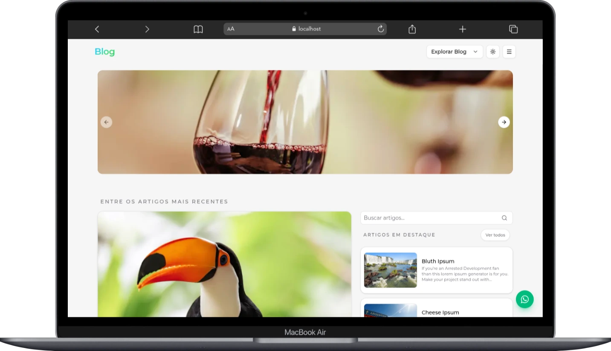
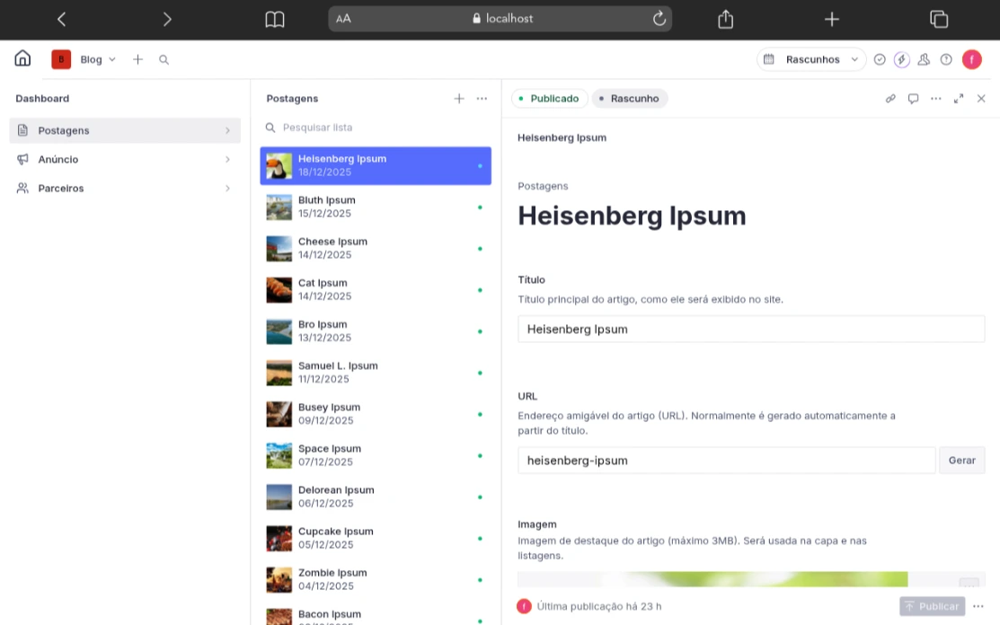

# Blog

A modern blog built with **Next.js 16** and **Sanity Studio**, featuring a clean, responsive UI and a simple content editing experience.

---

## Home Page



---

## Tech Stack

- **Frontend**
  - Next.js 16 (App Router)
  - React 19
  - TypeScript 5
  - Tailwind CSS 4
  - Radix UI / shadcn‑style components
  - lucide-react icons

- **CMS & Data**
  - Sanity Studio
  - `next-sanity`
  - GROQ for queries

- **Content & Utilities**
  - `@portabletext/react` & `@portabletext/types`
  - `@sanity/image-url`
  - `date-fns`
  - `zod`
  - `react-hook-form`

---

## Project Structure

```txt
.
├─ app/                  # Next.js app (public site)
│  ├─ page.tsx           # Home
│  ├─ blog/              # Blog listing
│  ├─ [slug]/            # Post pages
│  ├─ error.tsx
│  ├─ not-found.tsx
│  └─ globals.css
│
├─ components/           # UI and domain components
├─ lib/                  # Sanity client, queries, blog helpers
├─ studio/               # Sanity Studio config and schemas
├─ public/               # Static assets + README images
└─ package.json
```

---

## Getting Started

### Prerequisites

- Node.js e 18
- pnpm / npm / yarn
- A Sanity project (project ID + dataset + optional read token)

### Installation

```bash
git clone https://github.com/<your-username>/<your-repo>.git
cd blog

pnpm install
# or
# npm install
```

### Environment Variables

Create a `.env.local` in the project root:

```bash
SANITY_PROJECT_ID=your_project_id
SANITY_DATASET=production
SANITY_READ_TOKEN=your_sanity_read_token
```

These are used in `lib/sanity.ts` to configure the Sanity client.

### Development

```bash
pnpm dev      # Next.js app at http://localhost:3000
# and, if Studio runs separately:
cd studio
pnpm dev      # Sanity Studio at http://localhost:3333
```

---

## Sanity Studio & Data

- Studio config lives in `studio/sanity.config.ts`.
- A custom navbar (`studio/customNavbar.tsx`) adds a **Home** button that opens `http://localhost:3000/`.
- Sanity data is fetched through:
  - `lib/sanity.ts` (client + helpers)
  - `lib/posts.ts`, `lib/hero.ts`, `lib/blog.ts` (GROQ queries and mappers)

Incremental Static Regeneration (ISR) is enabled on key routes via:

```ts
export const revalidate = 300
```

This means pages are statically generated and revalidated every 5 minutes.

---

## Images and Portable Text

- Images
  - Built with `@sanity/image-url` using `urlForImage` / `getImageUrl`.
  - Rendered with `next/image` for optimization and responsive sizing.
- Portable Text
  - Rendered in `components/post-portable-text.tsx` with `@portabletext/react`.
  - Custom components for images, files (e.g. video), embeds, headings, lists, quotes and links.

---

## Scripts

From `package.json`:

```json
{
  "scripts": {
    "dev": "next dev",
    "build": "next build",
    "start": "next start",
    "lint": "eslint",
    "format": "prettier --write ."
  }
}
```

---

## Admin Dashboard (Sanity Studio)



---

## License

This project is licensed under the **MIT License**.

Copyright (c) 2025 **Fernando Hiroshi Takeda**.

See the [`LICENSE`](./LICENSE) file for the full license text.
